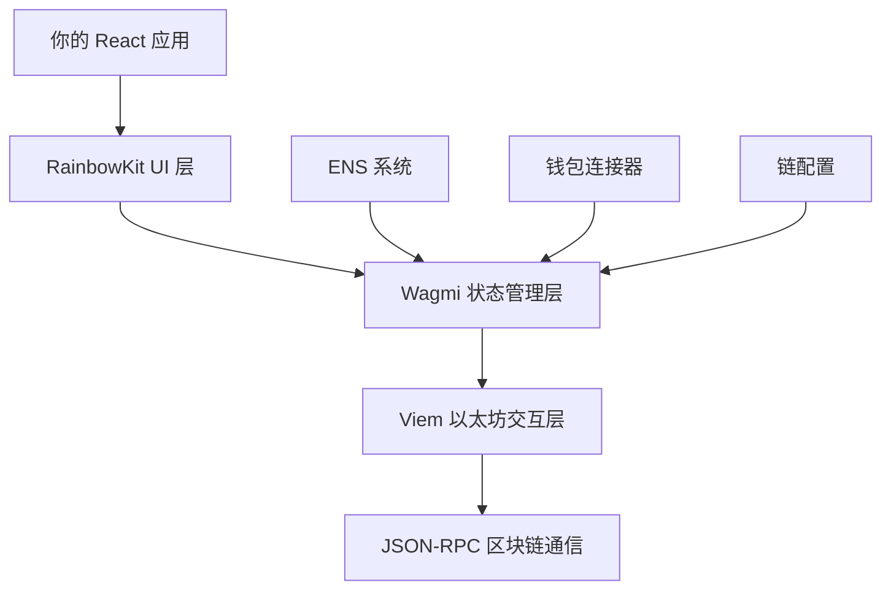
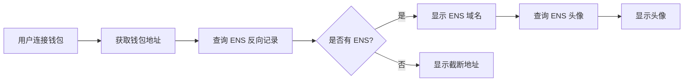

# RainbowKit 集成 Wagmi 流程详解

> 本文档详细介绍了如何在 Next.js 项目中集成 RainbowKit 和 Wagmi，并深入解析 ENS 系统的工作原理。

---

## 📚 目录

1. [技术架构概览](#技术架构概览)
2. [项目依赖安装](#项目依赖安装)
3. [配置流程](#配置流程)
4. [组件实现](#组件实现)
5. [ENS 解析详解](#ens-解析详解)
6. [实际代码解析](#实际代码解析)
7. [最佳实践](#最佳实践)

---

## 🏗️ 技术架构概览

### 架构层级关系



### 核心组件关系

| 组件 | 作用 | 依赖关系 |
|------|------|----------|
| **RainbowKit** | UI 组件库，提供钱包连接界面 | 基于 Wagmi |
| **Wagmi** | React Hooks 库，管理区块链状态 | 基于 Viem |
| **Viem** | TypeScript 以太坊库，处理底层交互 | 独立库 |
| **ENS** | 以太坊域名服务，地址解析系统 | 集成在 Wagmi 中 |

---

## 📦 项目依赖安装

### 核心依赖

```bash
# 安装 RainbowKit 和 Wagmi
npm install @rainbow-me/rainbowkit wagmi viem@2.x

# 安装 TanStack Query（Wagmi 的依赖）
npm install @tanstack/react-query

# 如果使用 TypeScript
npm install --save-dev @types/node
```

### 可选依赖

```bash
# 如果需要更多钱包连接器
npm install @wagmi/connectors

# 如果使用 Next.js 国际化
npm install next-intl
```

### 版本兼容性

```json
{
  "dependencies": {
    "@rainbow-me/rainbowkit": "^2.0.0",
    "wagmi": "^2.0.0",
    "viem": "^2.0.0",
    "@tanstack/react-query": "^5.0.0"
  }
}
```

---

## ⚙️ 配置流程

### 1. Wagmi 配置 (`wagmi.config.ts`)

```typescript
import { defineConfig } from 'wagmi'
import { mainnet, polygon, arbitrum, bsc } from 'wagmi/chains'
import { injected, metaMask, walletConnect } from 'wagmi/connectors'

export const config = defineConfig({
  chains: [mainnet, polygon, arbitrum, bsc],
  connectors: [
    injected(),
    metaMask(),
    walletConnect({ projectId: 'YOUR_PROJECT_ID' })
  ],
  ssr: true, // 启用服务端渲染支持
})
```

### 2. RainbowKit 配置 (`app/providers.tsx`)

```typescript
'use client'

import { QueryClient, QueryClientProvider } from '@tanstack/react-query'
import { WagmiProvider } from 'wagmi'
import { RainbowKitProvider, getDefaultConfig } from '@rainbow-me/rainbowkit'
import { mainnet, polygon, arbitrum, bsc } from 'wagmi/chains'

// 配置 Wagmi
const config = getDefaultConfig({
  appName: 'BSC Bound',
  projectId: 'YOUR_WALLETCONNECT_PROJECT_ID',
  chains: [mainnet, polygon, arbitrum, bsc],
  ssr: true,
})

const queryClient = new QueryClient()

export function Providers({ children }: { children: React.ReactNode }) {
  return (
    <WagmiProvider config={config}>
      <QueryClientProvider client={queryClient}>
        <RainbowKitProvider>
          {children}
        </RainbowKitProvider>
      </QueryClientProvider>
    </WagmiProvider>
  )
}
```

### 3. 样式导入 (`app/layout.tsx`)

```typescript
import '@rainbow-me/rainbowkit/styles.css'
import { Providers } from './providers'

export default function RootLayout({
  children,
}: {
  children: React.ReactNode
}) {
  return (
    <html lang="en">
      <body>
        <Providers>
          {children}
        </Providers>
      </body>
    </html>
  )
}
```

---

## 🧩 组件实现

### RainbowKit 自定义组件架构

```typescript
// ConnectWalletWithRainbowkit.tsx
import { ConnectButton } from '@rainbow-me/rainbowkit'

export default function ConnectWalletWithRainbowkit() {
  return (
    <ConnectButton.Custom>
      {({
        account,          // 账户信息
        chain,           // 当前链信息
        openAccountModal, // 账户弹窗
        openChainModal,   // 链切换弹窗
        openConnectModal, // 连接弹窗
        authenticationStatus, // 认证状态
        mounted,         // 挂载状态
      }) => {
        // 自定义 UI 逻辑
        return (
          // 你的自定义 UI
        )
      }}
    </ConnectButton.Custom>
  )
}
```

### 状态管理逻辑

```typescript
// 组件准备状态检查
const ready = mounted && authenticationStatus !== 'loading'

// 连接状态检查
const connected = ready && account && chain && 
  (!authenticationStatus || authenticationStatus === 'authenticated')
```

### UI 状态分支

```typescript
// 1. 未连接状态
if (!connected) {
  return <ConnectButton onClick={openConnectModal} />
}

// 2. 错误网络状态
if (chain.unsupported) {
  return <WrongNetworkButton onClick={openChainModal} />
}

// 3. 已连接状态
return <ConnectedWallet />
```

---

## 🌐 ENS 解析详解

### ENS (Ethereum Name Service) 基础概念

ENS 是以太坊的域名服务系统，类似于互联网的 DNS，但专为区块链设计。

#### 传统地址 vs ENS 域名

```
传统以太坊地址（42 位十六进制）：
0xd8dA6BF26964aF9D7eEd9e03E53415D37aA96045

ENS 域名（人类可读）：
vitalik.eth
```

### ENS 解析机制

#### 1. 正向解析（域名 → 地址）

```typescript
import { useEnsAddress } from 'wagmi'

function ResolveAddress() {
  const { data: address } = useEnsAddress({
    name: 'vitalik.eth',
  })
  
  // 结果: '0xd8dA6BF26964aF9D7eEd9e03E53415D37aA96045'
  return <div>地址: {address}</div>
}
```

#### 2. 反向解析（地址 → 域名）

```typescript
import { useEnsName } from 'wagmi'

function ResolveName() {
  const { data: ensName } = useEnsName({
    address: '0xd8dA6BF26964aF9D7eEd9e03E53415D37aA96045',
  })
  
  // 结果: 'vitalik.eth'
  return <div>ENS 名称: {ensName}</div>
}
```

#### 3. ENS 头像解析

```typescript
import { useEnsAvatar } from 'wagmi'

function ResolveAvatar() {
  const { data: ensAvatar } = useEnsAvatar({
    name: 'vitalik.eth',
  })
  
  // 结果: 'https://metadata.ens.domains/mainnet/avatar/vitalik.eth'
  return 
}
```

### ENS 记录类型

ENS 可以存储多种类型的数据：

```typescript
// ENS 可以绑定的记录类型
interface ENSRecords {
  address: string      // 以太坊地址
  avatar: string       // 头像图片
  description: string  // 个人描述
  display: string      // 显示名称
  email: string        // 邮箱地址
  keywords: string     // 关键词
  mail: string         // 邮件服务器
  notice: string       // 公告信息
  location: string     // 地理位置
  phone: string        // 电话号码
  url: string          // 个人网站
  
  // 社交媒体
  'com.github': string    // GitHub 用户名
  'com.twitter': string   // Twitter 用户名
  'com.discord': string   // Discord 用户名
  
  // 其他区块链地址
  btc: string          // 比特币地址
  ltc: string          // 莱特币地址
  doge: string         // 狗狗币地址
}
```

### ENS 在 RainbowKit 中的集成

#### 自动 ENS 解析流程



#### RainbowKit 内部实现原理

```typescript
// RainbowKit 内部逻辑（简化版）
function useAccountData(address: string) {
  // 1. 获取 ENS 名称
  const { data: ensName } = useEnsName({ address })
  
  // 2. 获取 ENS 头像
  const { data: ensAvatar } = useEnsAvatar({ 
    name: ensName 
  })
  
  // 3. 获取账户余额
  const { data: balance } = useBalance({ address })
  
  // 4. 格式化显示数据
  return {
    address,
    displayName: ensName || `${address.slice(0, 6)}...${address.slice(-4)}`,
    displayBalance: balance ? `${balance.formatted} ${balance.symbol}` : undefined,
    ensAvatar,
    ensName,
  }
}
```

---

## 🔍 实际代码解析

### 完整组件代码分析

我们项目中的 `ConnectWalletWithRainbowkit.tsx` 组件实现了以下功能：

#### 1. 导入和初始化

```typescript
"use client";
import React from "react";
import { ConnectButton } from '@rainbow-me/rainbowkit';
import { useTranslations } from "next-intl";

export default function ConnectWalletWithRainbowkit() {
  const t = useTranslations(); // 国际化支持
```

#### 2. 状态检查逻辑

```typescript
// 确保组件已挂载且认证完成
const ready = mounted && authenticationStatus !== 'loading';

// 检查完整连接状态
const connected = ready && account && chain && 
  (!authenticationStatus || authenticationStatus === 'authenticated');
```

#### 3. SSR 兼容性处理

```typescript
// 防止 SSR 水合不一致
{...(!ready && {
  'aria-hidden': true,
  'style': {
    opacity: 0,
    pointerEvents: 'none',
    userSelect: 'none',
  },
})}
```

#### 4. 三种 UI 状态

**未连接状态：**
```typescript
if (!connected) {
  return (
    <button onClick={openConnectModal}>
      连接钱包
    </button>
  );
}
```

**错误网络状态：**
```typescript
if (chain.unsupported) {
  return (
    <button onClick={openChainModal}>
      错误网络
    </button>
  );
}
```

**已连接状态：**
```typescript
return (
  <div>
    {/* 余额显示 */}
    {account.displayBalance && (
      <div>{account.displayBalance}</div>
    )}
    
    {/* 网络切换 */}
    <button onClick={openChainModal}>
      {chain.name}
    </button>
    
    {/* 账户信息 */}
    <button onClick={openAccountModal}>
      {account.ensAvatar && (
        
      )}
      {account.displayName}
    </button>
  </div>
);
```

### 响应式设计实现

使用 Tailwind CSS 自定义断点：

```typescript
// tailwind.config.ts 中的自定义断点
screens: {
  'mobile': {'max': '767px'},     // 手机专用
  'tablet': {'min': '768px', 'max': '1023px'}, // 平板专用
  'desktop': {'min': '1024px'},   // 桌面专用
}

// 组件中的响应式类名
className="
  px-4 py-2 mobile:px-3 mobile:py-1.5
  text-sm mobile:text-xs
  w-5 h-5 mobile:w-4 mobile:h-4
"
```

---

## 🎯 最佳实践

### 1. 性能优化

#### 懒加载 ENS 数据

```typescript
const { data: ensName, isLoading: ensNameLoading } = useEnsName({
  address,
  query: {
    enabled: !!address, // 仅在有地址时查询
    staleTime: 1000 * 60 * 5, // 5 分钟缓存
  }
})
```

#### 批量查询优化

```typescript
// 使用 React Query 的批量查询
const ensQueries = useQueries([
  {
    queryKey: ['ensName', address],
    queryFn: () => getEnsName(address),
    enabled: !!address,
  },
  {
    queryKey: ['ensAvatar', ensName],
    queryFn: () => getEnsAvatar(ensName),
    enabled: !!ensName,
  },
])
```

### 2. 错误处理

#### ENS 解析失败处理

```typescript
const { data: ensName, error: ensError } = useEnsName({ address })

const displayName = useMemo(() => {
  if (ensError) {
    console.warn('ENS 解析失败:', ensError)
    return `${address.slice(0, 6)}...${address.slice(-4)}`
  }
  return ensName || `${address.slice(0, 6)}...${address.slice(-4)}`
}, [ensName, ensError, address])
```

#### 网络切换失败处理

```typescript
const handleChainSwitch = async (chainId: number) => {
  try {
    await switchChain({ chainId })
  } catch (error) {
    if (error.code === 4902) {
      // 链未添加到钱包
      console.log('请手动添加此网络到钱包')
    } else if (error.code === 4001) {
      // 用户拒绝切换
      console.log('用户取消了网络切换')
    } else {
      console.error('网络切换失败:', error)
    }
  }
}
```

### 3. 安全考虑

#### 地址验证

```typescript
import { isAddress } from 'viem'

function validateAddress(address: string): boolean {
  return isAddress(address)
}
```

#### ENS 域名验证

```typescript
function validateENSName(name: string): boolean {
  return /^[a-z0-9-]+\.eth$/.test(name)
}
```

### 4. 用户体验优化

#### 加载状态处理

```typescript
if (isLoading) {
  return <Skeleton className="w-32 h-10" />
}

if (error) {
  return <Button variant="destructive">连接失败</Button>
}
```

#### 动画和过渡

```typescript
className="
  transition-all duration-200
  hover:scale-105 active:scale-95
  hover:shadow-lg
"
```

### 5. 国际化支持

#### 多语言配置

```typescript
// messages/zh.json
{
  "wallet": {
    "connected": "连接钱包",
    "disconnect": "断开连接",
    "wrongNetwork": "错误网络",
    "switchNetwork": "切换网络"
  }
}

// messages/en.json
{
  "wallet": {
    "connected": "Connect Wallet",
    "disconnect": "Disconnect",
    "wrongNetwork": "Wrong Network",
    "switchNetwork": "Switch Network"
  }
}
```

---

## 🚀 部署注意事项

### 1. 环境变量配置

```bash
# .env.local
NEXT_PUBLIC_WALLETCONNECT_PROJECT_ID=your_project_id
NEXT_PUBLIC_ENABLE_TESTNETS=true
```

### 2. 构建优化

```typescript
// next.config.js
/** @type {import('next').NextConfig} */
const nextConfig = {
  experimental: {
    optimizePackageImports: ['@rainbow-me/rainbowkit', 'wagmi'],
  },
  webpack: (config) => {
    config.resolve.fallback = { fs: false, net: false, tls: false };
    return config;
  },
}

module.exports = nextConfig
```

### 3. CSP 头配置

```typescript
// 内容安全策略
const ContentSecurityPolicy = `
  default-src 'self';
  script-src 'self' 'unsafe-eval' 'unsafe-inline';
  style-src 'self' 'unsafe-inline';
  img-src 'self' data: https:;
  connect-src 'self' https://mainnet.infura.io https://api.opensea.io;
`
```

---

## 📈 监控和分析

### 1. 连接成功率监控

```typescript
import { track } from './analytics'

const handleConnect = () => {
  track('wallet_connect_attempt', {
    connector: connector.name,
    chainId: chain.id,
  })
  
  connect({ connector })
}
```

### 2. ENS 解析性能监控

```typescript
const startTime = performance.now()

const { data: ensName } = useEnsName({ 
  address,
  onSuccess: () => {
    const duration = performance.now() - startTime
    track('ens_resolve_success', { duration })
  },
  onError: (error) => {
    track('ens_resolve_error', { error: error.message })
  }
})
```

---

## 📚 参考资源

### 官方文档

- [RainbowKit 官方文档](https://rainbowkit.com)
- [Wagmi 官方文档](https://wagmi.sh)
- [Viem 官方文档](https://viem.sh)
- [ENS 官方文档](https://docs.ens.domains)

### 社区资源

- [RainbowKit GitHub](https://github.com/rainbow-me/rainbowkit)
- [Wagmi GitHub](https://github.com/wagmi-dev/wagmi)
- [ENS GitHub](https://github.com/ensdomains)

### 工具和服务

- [WalletConnect](https://walletconnect.com) - 钱包连接协议
- [Infura](https://infura.io) - 以太坊节点服务
- [Alchemy](https://alchemy.com) - 区块链开发平台

---

## 📝 总结

本文档详细介绍了 RainbowKit 集成 Wagmi 的完整流程，包括：

1. **技术架构** - 理解各层级关系和职责分工
2. **配置流程** - 从依赖安装到项目配置的完整步骤
3. **组件实现** - 自定义 UI 组件的开发方法
4. **ENS 解析** - 深入理解以太坊域名服务的工作原理
5. **最佳实践** - 性能优化、错误处理、安全考虑等

通过本文档的指导，开发者可以：
- 快速集成 RainbowKit 和 Wagmi
- 理解 ENS 系统的工作机制
- 构建高质量的 Web3 钱包连接体验
- 避免常见的开发陷阱

RainbowKit + Wagmi 的组合为 Web3 应用提供了强大而灵活的钱包连接解决方案，是现代 DApp 开发的首选技术栈。

---

*最后更新时间：2025年9月3日*  
*文档版本：v1.0.0*  
*作者：BSC Bound 开发团队*
